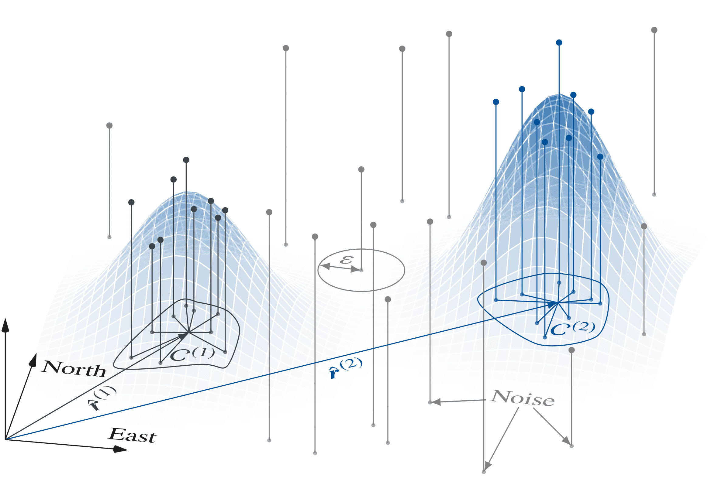

## Particle-Filter-Based Multiple Updraft Estimator 

### Overview
This repository contains a flight-tested *Python* implementation of a particle-filter-based multiple updraft estimator. The filter was developed by researchers at the [Institute of Flight Mechanics and Controls (iFR)](https://www.ifr.uni-stuttgart.de/) at the University of Stuttgart. Given its non-parametric nature, the particle-filter-based updraft estimator offers the unique ability to estimate the position, strength, and spread of several thermals, at once.

The estimator has been employed to localize real updrafts during flight tests. The filter subject to the published source code is executable on low-cost embedded hardware. The designers have been executing the estimator on a *Raspberry Pi Zero*, which functions as a co-processor for a *Pixhawk 4* flight controller.
The estimator has been successfully employed for [autonomous soaring](https://github.com/ifrunistuttgart/RL_CrossCountrySoaring) to make an unmanned glider aircraft localize and exploit thermal updrafts.

For more detailed information about the theoretical background of the particle filter based multiple updraft estimator, we refer the reader to the associated paper listed below.

<figure>
 
 <figcaption>Particle filter working principle illustration.</figcaption>
</figure>

### Getting started
The actual implementation of the particle filter is located in the *particle_filter*  folder. As it is impractical to log the particles during the flight due to memory limitations, *run_postprocessing.py* re-calculates the particle distribution from the captured flight data. The *MATLAB* script *showPostprocessingResult.m* visualizes the particles,
as well as the estimated updrafts during the flight test.

### Credits
If you apply the filter or build upon the algorithm in an academic context, please cite:

> Notter, S., Groß, P., Schrapel, P., and Fichter, W., “Multiple Thermal Updraft Estimation and Observability Analysis,” Journal
of Guidance, Control, and Dynamics, Vol. 43, No. 3, 2020, pp. 490–503. doi:10.2514/1.G004205
